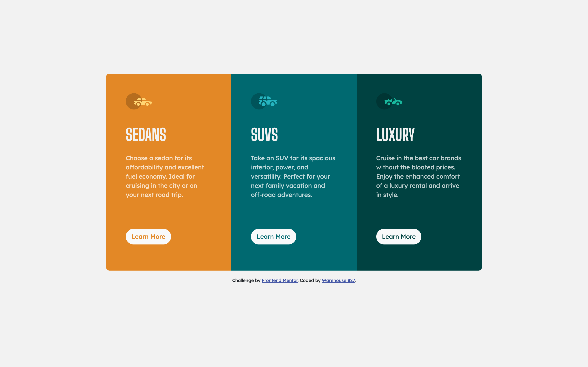

### Screenshot

# Frontend Mentor - 3-column preview card component solution

This is a solution to the [3-column preview card component challenge on Frontend Mentor](https://www.frontendmentor.io/challenges/3column-preview-card-component-pH92eAR2-). Frontend Mentor challenges help you improve your coding skills by building realistic projects. 

## Table of contents

- [Overview](#overview)
  - [The challenge](#the-challenge)
  - [Screenshot](#screenshot)
  - [Links](#links)
- [My process](#my-process)
  - [Built with](#built-with)
- [Author](#author)

## Overview

### Links

- Solution URL: [https://github.com/warehouse827/3-column-preview-card-component.git]
- Live Site URL: [https://warehouse827.github.io/3-column-preview-card-component/]

## My process

### Built with

- Bootstrap 5.2
- CSS custom properties
- Flexbox
- Mobile-first workflow

## Author

- Website - [https://warehouse827.com]
- Frontend Mentor - [https://www.frontendmentor.io/profile/warehouse827]
